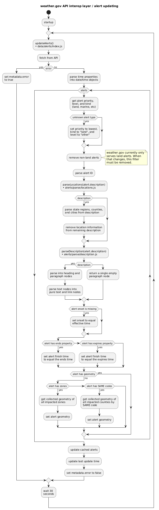

# weather.gov API interop layer

We built an interop layer between weather.gov and the NWS public API to simplify
the data entering the page rendering process. The interop layer handles the
multiple requests necessary to the API, retrying in the event of errors, unit
normalization and conversion, etc.

## Caching

### Alerts

The alerts module fetches all active alerts as soon as the interop layer starts
and then every 30 seconds thereafter. This background process handles fetching,
parsing, and normalizing all the alerts. It also transparently handles errors
with the goal of always presenting alerts if we're able.

Flow diagram of how alerts are updated:

## Endpoints

There is currently only one functional endpoint in the interop layer, as it was
originally conceived as a way of having a one-stop-shop for all the data we
needed in order to render a location forecast.

### `/point/{lat}/{lon}`

[Schema of returned data](interop/README.md)

Flow diagram of how it works:

## Production setup

By default, dev instances of the API interop layer are public. If we wish to
make the API interop layer private (that is, not accessible from outside) for a
given environment, then we have to set up [secure container-to-container
networking](https://cloud.gov/docs/management/container-to-container/#configuring-secure-container-to-container-networking)
on cloud.gov.

First, we want to make the API interop layer accessible internally via `apps.internal`:

    cf map-route api-weathergov-$NAME apps.internal --hostname api-weathergov-$NAME

And tunnel all internal access via TCP port 61443 (SSL/TLS).

    cf add-network-policy weathergov-$NAME api-weathergov-$NAME --protocol tcp --port 61443

Optionally, you may want to unmap and/or remove the older route if extant:

    cf unmap-route api-weathergov-$NAME app.cloud.gov --hostname api-weathergov-$NAME
    cf delete-orphaned-routes # or delete the route explicitly

Finally, configure the manifest.yml with the appropriate settings. The interop
layer should have its `route` set to `api-weathergov-$NAME.apps.internal`, while
the Drupal instance should have the environment variable `API_INTEROP_URL` set
to the tunneled port: `https://api-weathergov-$NAME.apps.internal:61443`.

To confirm that secure container-to-container networking is properly set up, you
can `cf ssh` in the instance, make sure `$API_INTEROP_URL` is updated to use
port 61443, and then `curl -v $API_INTEROP_URL`. This should result in a
`{"ok":true}` response from the API interop layer.
