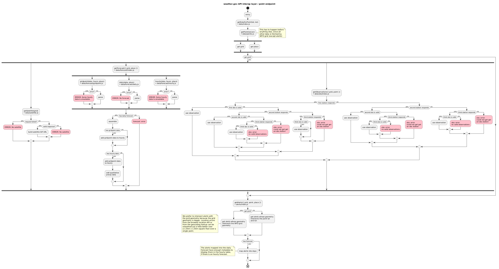
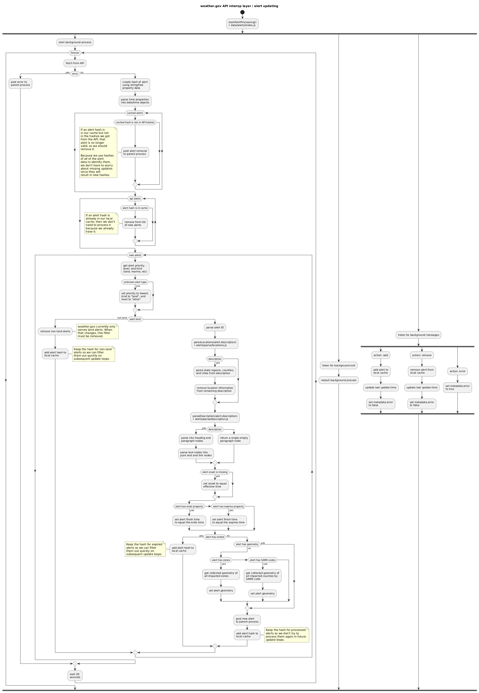

# API Interop Layer Documentation

## Overview

The API Interop Layer acts as a middleware between the legacy weather.gov API and the new frontend application. It normalizes data structures, handles caching, and ensures consistent data delivery.

We built this interop layer to simplify the data entering the page rendering process. It handles the multiple requests necessary to the API, retrying in the event of errors, unit normalization and conversion, etc.

## Technical Details

### Architecture & Tech Stack
The interop layer is currently in a transition phase. While the production runtime remains Node.js, we are actively porting performance-critical components to Golang.

**Key Technologies:**
- **Current Runtime:** Node.js (Fastify + TypeScript)
- **Target Architecture:** Golang (High-Performance Core)
- **Database:** PostgreSQL (for caching/persistence)

### Migration to Golang
We are migrating the core data processing and API orchestration logic to Golang to address performance bottlenecks inherent in the Node.js event loop for CPU-bound tasks. Benchmarks have validated that the Go implementation offers significantly lower latency for complex weather data transformations.

See the [Golang Utilities Documentation](golang-utilities.md) for details on the ported utilities and architecture.

## Endpoints

There is currently only one functional endpoint in the interop layer, as it was originally conceived as a way of having a one-stop-shop for all the data we needed in order to render a location forecast.

### `/point/{lat}/{lon}`

[Schema of returned data](definitions/index.md)

Flow diagram of how it works:



### OpenAPI Documentation

The API Interop Layer includes auto-generated OpenAPI documentation served via Swagger UI.

**Viewing Documentation Locally:**

1. Start the interop layer:
    - **NPM:** `npm run start-dev` (in `api-interop-layer` directory)
    - **Docker Compose:** `docker compose up api-interop-layer`

2. Access the documentation:
    - **OpenAPI UI:** [http://localhost:8082/documentation](http://localhost:8082/documentation)
    - **OpenAPI JSON Spec:** [http://localhost:8082/documentation/json](http://localhost:8082/documentation/json)

## Caching

### Alerts

The alerts module fetches all active alerts as soon as the interop layer starts and then every 30 seconds thereafter. This background process handles fetching, parsing, and normalizing all the alerts. It also transparently handles errors with the goal of always presenting alerts if we're able.

Flow diagram of how alerts are updated:




## Testing

### Regression Testing

Regression testing is critical to ensure that changes do not break existing functionality. We use **Mocha** as the test runner and **Chai** for assertions.

**Running Regression Tests:**
```bash
cd api-interop-layer
npm test
```

### Test Coverage

We aim for high test coverage to maintain code quality. Coverage is measured using `c8`.

**Checking Coverage:**
Running `npm test` will automatically generate a coverage report. The HTML report can be found in `api-interop-layer/coverage/`.

## Performance

Performance is a key metric for the interop layer as it directly impacts user experience.

### Performance Tests

Performance tests are located in `api-interop-layer/src/util/perf/`.

**Running Performance Tests:**
```bash
cd api-interop-layer
npm run test:perf
```

### Performance Results
> Last Updated: 2026-02-05

### Performance Improvements

We have significantly improved the performance of the API Interop Layer by migrating compute-intensive components to Golang. The new architecture handles heavy JSON transformation and date manipulation much more efficiently than the original Node.js implementation.

**Key Latency Reductions:**
- **Forecast Processing**: ~12x faster
- **Timezone Conversion**: ~170x faster
- **Total Request Latency**: The end-to-end processing time for forecast data has dropped from >1.2ms to ~0.25ms (a >5x improvement).

See the [Benchmarks Documentation](benchmarks.md) for detailed comparisons and methodology.

### Impact on User Experience

These server-side performance gains directly translate to faster page loads for end users. By minimizing processing time on the server, the Time to First Byte (TTFB) is reduced, allowing the client to begin rendering the forecast sooner. The improved efficiency also reduces CPU load on the infrastructure, allowing the system to handle higher concurrent traffic volumes without service degradation.

## Production Setup

By default, dev instances of the API interop layer are public. If we wish to make the API interop layer private (that is, not accessible from outside) for a given environment, then we have to set up [secure container-to-container networking](https://cloud.gov/docs/management/container-to-container/#configuring-secure-container-to-container-networking) on cloud.gov.

First, we want to make the API interop layer accessible internally via `apps.internal`:

    cf map-route api-weathergov-$NAME apps.internal --hostname api-weathergov-$NAME

And tunnel all internal access via TCP port 61443 (SSL/TLS).

    cf add-network-policy weathergov-$NAME api-weathergov-$NAME --protocol tcp --port 61443

Optionally, you may want to unmap and/or remove the older route if extant:

    cf unmap-route api-weathergov-$NAME app.cloud.gov --hostname api-weathergov-$NAME
    cf delete-orphaned-routes # or delete the route explicitly

Finally, configure the manifest.yml with the appropriate settings. The interop layer should have its `route` set to `api-weathergov-$NAME.apps.internal`, while the Drupal instance should have the environment variable `API_INTEROP_URL` set to the tunneled port: `https://api-weathergov-$NAME.apps.internal:61443`.

To confirm that secure container-to-container networking is properly set up, you can `cf ssh` in the instance, make sure `$API_INTEROP_URL` is updated to use port 61443, and then `curl -v $API_INTEROP_URL`. This should result in a `{"ok":true}` response from the API interop layer.
