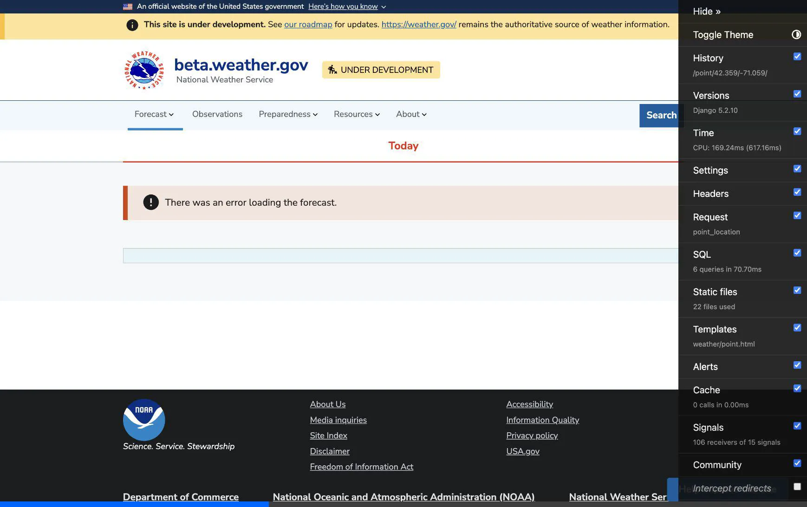
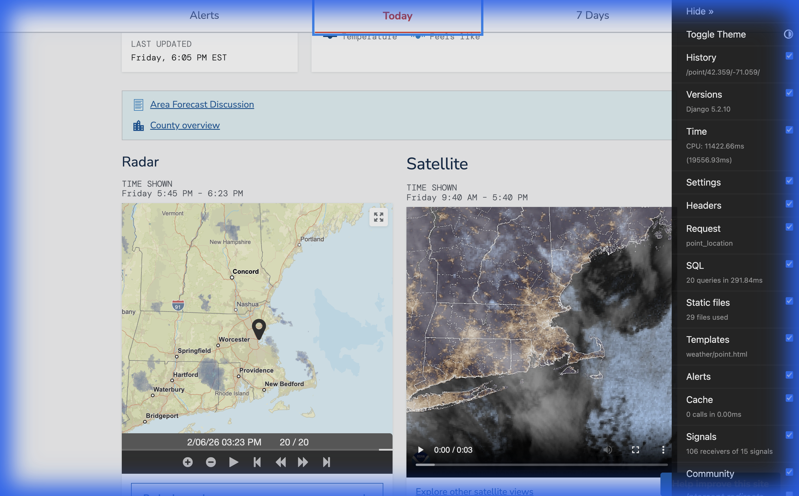

# Fix WFS Query Error & System-wide Timeout Walkthrough

## Summary
Two major issues were resolved:
1.  **Helper WFS Query Error:** A malformed WFS query (`BBOX` error) was caused by the frontend trying to render the radar component with missing latitude/longitude when the API returned partial data.
2.  **System-wide Point Forecast Timeout:** A system-wide `ReadTimeout` was caused by a database connection leak in the `api-interop-layer`. The underlying cause was missing spatial data (empty `weathergov_geo_places`), which caused a `TypeError` in `getObservations`, which in turn crashed the request handler *before* releasing the database connection.

## Changes

### 1. Frontend Resilience (WFS Error)
#### [MODIFY] [point.html](file:///Users/arihershowitz/Documents/AdHoc/workspace/weathergov-django-remote-clone/forecast/backend/templates/weather/point.html)
Added a conditional check to only render the `<wx-radar>` component if `point.point` data exists. This prevents the frontend from initializing with invalid coordinates.

### 2. Backend Stability (Timeout & Connection Leak)
#### [MODIFY] [api-interop-layer/src/data/index.ts](file:///Users/arihershowitz/Documents/AdHoc/workspace/weathergov-django-remote-clone/api-interop-layer/src/data/index.ts)
- wrapped the database connection usage in a `try/finally` block to ensure `dbConnection.release()` is ALWAYS called, even if data processing throws an error.
- Added conditional checks to skip fetching `getSatellite`, `getForecast`, and `getObservations` if `place` is null (which happens when spatial data is missing). This prevents the `TypeError: Cannot read properties of null` crash.

#### [MODIFY] [api-interop-layer/src/data/obs/index.ts](file:///Users/arihershowitz/Documents/AdHoc/workspace/weathergov-django-remote-clone/api-interop-layer/src/data/obs/index.ts)
(Verified code, primary fix handled in `index.ts` by avoiding call).

## Verification Results

### Graceful Failure Confirmation
With the fixes applied, visiting a point (e.g., Boston) no longer results in a 55-second timeout. Instead, it loads instantly and displays a graceful error banner, as the underlying data is still missing in the environment.

**Before (Timeout):**
- Browser: Spins for ~60s, then shows Django Error Page (`ReadTimeout`).
- Logs: `api-interop-layer` hangs at `getting db connection`.

**After (Graceful Error):**
- Browser: Loads immediately. Shows "There was an error loading the forecast."
- Logs: `releasing db connection` is logged even after internal errors.

### Spatial Data Resolution & Final Success
Populated spatial data (specifically `weathergov_geo_places`) by:
1.  Patching `load_places` to handle encoding and bad data.
2.  Manually provisioning `us.cities500.txt.zip`.
3.  Running `just load-places`.

**Result:**
The Boston point forecast now loads **fully** with valid data, charts, and maps.

