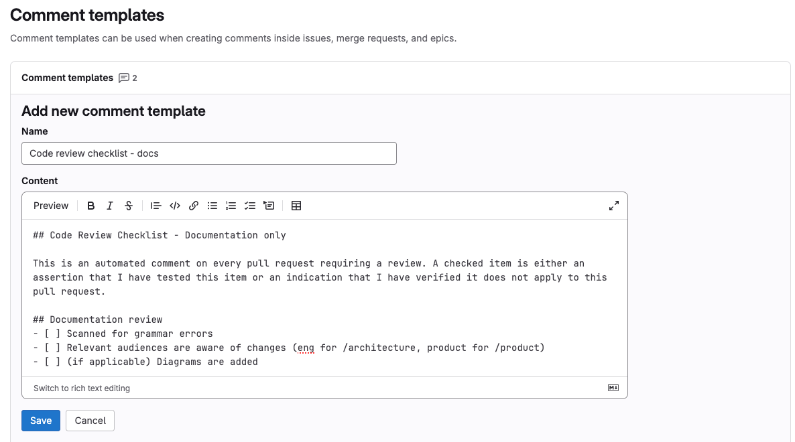
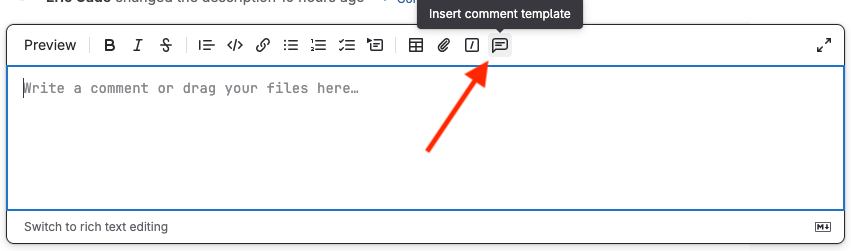

We manage our templates for doing code review as [comment templates](https://docs.gitlab.com/user/profile/comment_templates/). Add these to your code review process by:

1. Going to [https://vlab.noaa.gov/gitlab-licensed/-/profile/comment_templates](https://vlab.noaa.gov/gitlab-licensed/-/profile/comment_templates)
2. Adding a new reply for each [code review template](../code-review-templates/) by copying and pasting the markdown
   
3. Using the reply as part of code review!
   
