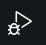
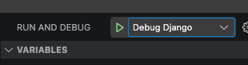

# Debugging

Oh sure we can `print()` and `console.log` to our hearts' content to figure out
what's going wrong in code, but sometimes (often?) it's much easier if you can
attach a debugger and actually see what's happening.

## Django

Our Django app sets up debugging through [debugpy](https://github.com/microsoft/debugpy)
if the `DEBUG` setting is true and it launches through the main process. It
is listening on on port `34235` by default, but is configurable by setting the
`DEBUG_PORT` environment variable. In our docker compose environment, the port
is explicitly set to `34235` and is exposed to the host.

You can attach your favorite tool that uses the Debug Adapter Protocol (DAP) for
Python. (DAP is a Microsoft effort to abstract the interface between debuggers
and IDEs.) There are, for example, a [Neovim plugin](https://github.com/HiPhish/debugpy.nvim)
and an [Emacs plugin](https://github.com/svaante/dape).

For anyone using VSCode, our repo contains `launch.json` configurations that
also setup to attach the debugger. You will need to install the
[Python Debugger extension](https://marketplace.visualstudio.com/items?itemName=ms-python.debugpy).
Once that's done and Django is running in its container, you can click the
debugging side panel button:

Then choose "Debug Django" form the dropdown and click the green play button:

In all cases, you should be able to set breakpoints and inspect locals.

## API interop layer

The interop layer is a Node.js app. In our development environment, it is managed
by the [PM2 process manager](https://pm2.io/) which handles automatically
restarting it whenever code is changed. Our PM2 configuration also sets up the
Node debugger to listen on port `9229`, which is then exposed in our Docker
compose environment. Any Node.js debugger can attach to `localhost` on port
`9229`.

We also have an interop debugger configuration in our VSCode `launch.json`.
Node.js debugging support is built into VSCode, so there's no need for any other
extensions or plugins. Just click the debug button, select "Debug interop,"
and click the green play button to get connected.

> [!NOTE]  
> VSCode can be connected to both debuggers simultaneously. After connecting
> one, change the dropdown to the other and click the play button again. Super

## Troubleshooting Archives

We maintain a collection of automated debugging sessions and walkthroughs in the [Auto-Debug Logs](auto-debug/index.md). These logs document complex issues, their root causes, and verification steps.
