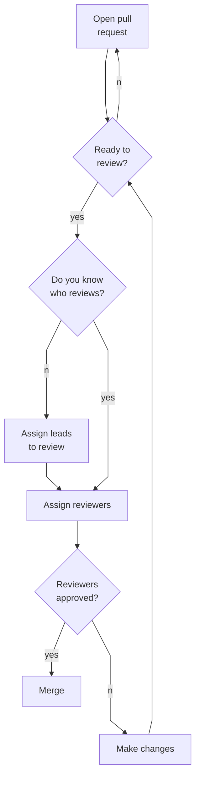

# Project review standards

### Branching and tagging strategy

The `main` branch is the source of truth for the most current version of the
code. It cannot be directly modified by pushing to it and can only be updated
via pull requests.

Additional reserved branch names will be created as needed and documented here.

Individual developers should create branches as needed for their work. We
encourage meaningful branch names. For example `billy/141-make-it-rain`
might be a branch opened by a teammate named Billy to work on issue #141 about
causing it to rain. This naming convention can help the rest of the team quickly
see what a branch is for.

### Pull request process

We use pull requests (PR) to merge new code into the project. PRs give us an
opportunity to apply automated tests and human reviews of changes before they
are accepted into our main branch to be released. Anyone may create a PR at any
time. The process for reviewing PRs is outlined here.

1. Open a pull request.

   - If the PR is not yet ready for review, open it as a draft PR and stop here
     until it is ready.

2. Assign the product, design, and engineering leads as reviewers, as
   appropriate.

   - The area leads will scan the PR to determine who should review it. They may
     also review it themselves.

   - If you know who needs to review your PR needs, feel free to assign those
     people directly instead of assigning the leads.

3. If the review needs a meeting or discussion time, add it to the
   [discussion topics](https://docs.google.com/spreadsheets/d/1wd9WsmNHdLXl-smL_A63oBDRIkALJTELXcITl4iTdMs/edit#gid=1456748459)
   and we'll pick it up at the end of a standup. If it lingers more than a
   couple of days, ping an area lead.

4. If reviewers have questions or see things that need to be fixed or changed,
   they should leave those questions or comments in the review. Do not mark the
   PR as "approved" unless you really mean it.

   - It is okay to mark a PR as approved if you only want a small change or have
     a minor question and don't want the PR author to have to wait for you to
     review it again later. We are allowed to trust each other if we want to.
     But for bigger changes, mark the PR as "changes requested" or "comment."

   - If a PR uncovers work _outside the scope of the PR_ that needs to be done,
     document that with new issues. Refer to the PR in the new issue.

     - If the new work is technical debt or a bug, place it directly into the
       backlog instead of the project inbox and label it accordingly.

5. When all requested reviewers have approved a PR (and the required automated
   checks have completed successfully), it can be merged. **PRs should be merged
   by their authors**, since they have the most context about it and can resolve
   any merge conflicts that might arise.

   - PR authors are free to enable auto-merge on their PRs and GitHub will
     automatically merge it once all of the requirements below are satisfied.

   - We merge using the squash+rebase strategy in GitHub. The GitHub behavior is
     something like this:

     ```sh
     git checkout main
     git merge --squash <branch>
     git push
     ```

     > [!NOTE]  
     > You cannot actually do it manually in our repo as the `main` branch does
     > not allow remote pushes.



#### Branch protections

PRs cannot be merged into `main` unless they satisfy our branch protection
rules:

- All PRs must be reviewed and approved by at least one other person.
- All PRs must pass all required automated checks. The list of required checks
  will evolved over time.
- Any code that is exempted from automated tests must be documented and
  explained in code itself as well as the pull request. Code my be exempted due
  to false positives that cannot be resolved in other ways; true positives that
  will be resolved in a future fix; or similar scenarios.
- All commits in a PR must be
  [cryptographically signed](https://calebhearth.com/sign-git-with-ssh)
  by their authors.
  ([GPG signatures](https://docs.github.com/en/authentication/managing-commit-signature-verification/signing-commits)
  are also allowed, though SSH is easier to configure and thus encouraged.)
- All merges into `main` will be pushed into a merge queue. Merge queues help
  reduce the friction of merging PRs where multiple need to be done at once. PRs
  go into the queue and get batched up, tested, and merged all at once. There's
  no need for PR authors to merge from `main` before merging _into_ `main`.

### Merging strategy

We use squash merging in the merge queue. PR authors do not need to select
anything as this is handled automatically.

### Deployment strategy

Deployments into preview and/or staging environments happen automatically from
the appropriate branches.

Deployments into production will be managed via tagged releases. When a new tag
is created in the form `v1.3`, a new production deployment will be triggered
from that tag. We will create tags via GitHub releases rather than creating them
manually so we can associate them with release notes, documenting what is
changing. Using tags also allows us an opportunity to review an entire release
candidate as a whole before deploying it.

> [!WARNING]  
> Even though pushing to the `main` branch is disabled, tags applied to commits
> on the `main` branch **_can_** be pushed. Be very careful with manually
> tagging the repo. If your tag matches the `vX.Y` format indicating a new
> production release, it **_will_** trigger a deployment into production.

> [!NOTE]  
> In the future, our deployment strategy should also include building provenance
> documentation so a given deployment can be traced back to its original place
> in the git tree without having to worry about tags being deleted, renamed, or
> moved. Additionally, the artifacts of a deployment build should allow the
> release to be rebuilt in-place without relying on mutable git attributes, such
> as tags or even hashes. A given deployment should be recreatable without any
> external content or context.
