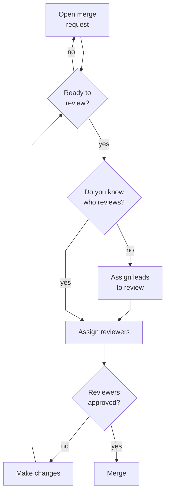

# Project review standards

### Branching and tagging strategy

The `main` branch is the source of truth for the most current version of the
code. It cannot be directly modified by pushing to it and can only be updated
via pull requests.

Additional reserved branch names will be created as needed and documented here.

Individual developers should create branches as needed for their work. We
encourage meaningful branch names. For example `billy/141-make-it-rain`
might be a branch opened by a teammate named Billy to work on issue #141 about
causing it to rain. This naming convention can help the rest of the team quickly
see what a branch is for.

### Merge request process

We use merge requests (MR) to merge new code into the project. MRs give us an
opportunity to apply automated tests and human reviews of changes before they
are accepted into our main branch to be released. Anyone may create a MR at any
time. The process for reviewing MRs is outlined here.

1. Open a merge request.

   - If the MR is not yet ready for review, open it as a draft MR and stop here
     until it is ready.

     > [!NOTE]  
     > In addition to checking the box in the MR form, you may also mark an MR
     > as draft by starting its title with `Draft:`

2. Assign the product, design, and engineering leads as reviewers, as
   appropriate.

   - The area leads will scan the MR to determine who should review it. They may
     also review it themselves.

   - Please note that all MRs will be reviewed with security in mind.
     Nonetheless, if you are aware of any security implications or concerns in
     the MR, please call these out explicitly in the MR description or contact
     us directly.

   - If you know who needs to review your MR needs, feel free to assign those
     people directly instead of assigning the leads.

3. ~~If the review needs a meeting or discussion time, add it to the
   [discussion topics](https://docs.google.com/spreadsheets/d/1wd9WsmNHdLXl-smL_A63oBDRIkALJTELXcITl4iTdMs/edit#gid=1456748459)
   and we'll pick it up at the end of a standup. If it lingers more than a
   couple of days, ping an area lead.~~

   > [!NOTE]  
   > A new team has been constituted and we're reviewing our processes now.
   > This particular step is under review.

4. If reviewers have questions or see things that need to be fixed or changed,
   they should leave those questions or comments in the review. Do not mark the
   MR as "approved" unless you really mean it.

   - It is okay to mark an MR as approved if you only want a small change or have
     a minor question and don't want the MR author to have to wait for you to
     review it again later. We are allowed to trust each other if we want to.
     But for bigger changes, mark the MR as "changes requested" or "comment."

   - If an MR uncovers work _outside the scope of the MR_ that needs to be done,
     document that with new issues. Refer to the MR in the new issue.

     - ~~If the new work is technical debt or a bug, place it directly into the
       backlog instead of the project inbox and label it accordingly.~~

       > [!NOTE]  
       > This particular step is under review.

5. When all requested reviewers have approved an MR (and the required automated
   checks have completed successfully), it can be merged. **MRs should be merged
   by their authors**, since they have the most context about it and can resolve
   any merge conflicts that might arise.

   - MR authors are free to enable auto-merge on their MRs and GitLab will
     automatically merge it once all of the requirements below are satisfied.

   - ~~We merge using the merge commits in GitLab.~~
     > [!NOTE]  
     > This particular step is under review.

```mermaid
%%{ init: { "flowchart": { "curve": "linear" }}}%%
graph TD;
  A[Open merge<br>request]-->B{Ready to<br>review?};
  B-->|no|A
  B-->|yes|C{Do you know<br>who reviews?}
  C-->|no|D[Assign leads<br>to review]
  D-->E[Assign reviewers]
  C-->|yes|E
  E-->F{Reviewers<br>approved?}
  F-->|no|G[Make changes]-->B
  F-->|yes|H[Merge]
```

#### Branch protections

MRs cannot be merged into `main` unless they satisfy our branch protection
rules:

- All MRs must be reviewed and approved by at least one other person.
- ~~All MRs must pass all required automated checks. The list of required checks
  will evolve over time.~~
  > [!NOTE]  
  > We are in the process of migrating from Drupal to Django, so tests are being
  > rewritten. In the short-term, automated tests are not required.
- Any code that is exempted from automated tests must be documented and
  explained in code itself as well as the merge request. Code may be exempted due
  to false positives that cannot be resolved in other ways; true positives that
  will be resolved in a future fix; or similar scenarios.
- All commits in an MR must be
  [cryptographically signed](https://calebhearth.com/sign-git-with-ssh)
  by their authors.
  ([GPG signatures](https://docs.github.com/en/authentication/managing-commit-signature-verification/signing-commits)
  are also allowed, though SSH is easier to configure and thus encouraged.)
- MRs must be up-to-date with `main` before they can be merged. This helps
  ensure that tests are run against the actual end state and incorporate changes
  that were made in other MRs.

### Merging strategy

~~We use merge commits to preserve history.~~

> [!NOTE]  
> This is currently under review.

### Deployment strategy

~~Deployments into preview and/or staging environments happen automatically from
the appropriate branches.~~

~~Deployments into production will be managed via tagged releases. When a new tag
is created in the form `v1.3`, a new production deployment will be triggered
from that tag. We will create tags via GitHub releases rather than creating them
manually so we can associate them with release notes, documenting what is
changing. Using tags also allows us an opportunity to review an entire release
candidate as a whole before deploying it.~~

> [!NOTE]  
> Automated deployments are not yet running.

> [!WARNING]  
> Even though pushing to the `main` branch is disabled, tags applied to commits
> on the `main` branch **_can_** be pushed. Be very careful with manually
> tagging the repo. If your tag matches the `vX.Y` format indicating a new
> production release, it **_will_** trigger a deployment into production.

> [!NOTE]  
> In the future, our deployment strategy should also include building provenance
> documentation so a given deployment can be traced back to its original place
> in the git tree without having to worry about tags being deleted, renamed, or
> moved. Additionally, the artifacts of a deployment build should allow the
> release to be rebuilt in-place without relying on mutable git attributes, such
> as tags or even hashes. A given deployment should be recreatable without any
> external content or context.

### Dependabot

~~We use [GitHub Dependabot](https://github.com/dependabot) for automated
dependency update scanning. If a Dependabot-submitted PR has a minor or patch
[semver](https://semver.org/) update **and** passes CI tests, then the PR is
likely safe to merge. It is up to the PR reviewer to exercise their best
judgment when automated dependency updates come in.~~

~~If there is a major semver update, however, then it is strongly encouraged to
check the release notes for the library to see what changed, and to manually
test the major update locally before approving the Dependabot PR.~~

> [!NOTE] We are moving to GitLab CI/CD. We will need to investigate automated
> dependency updates.
