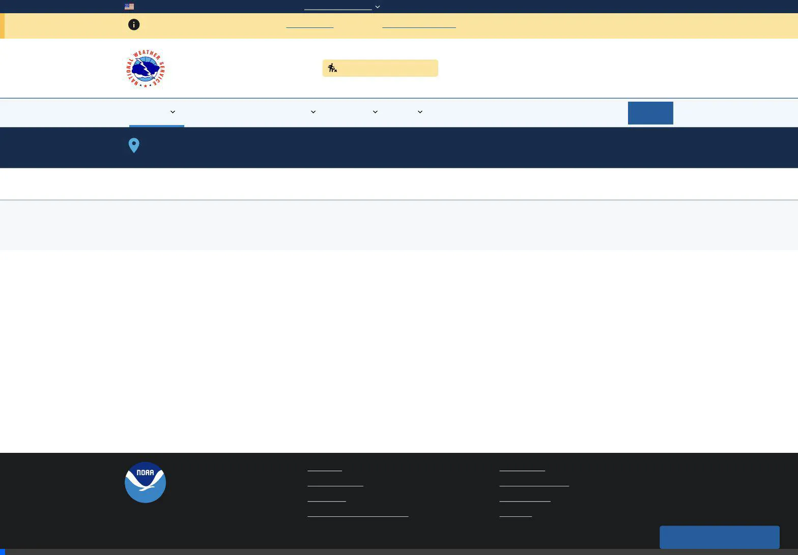
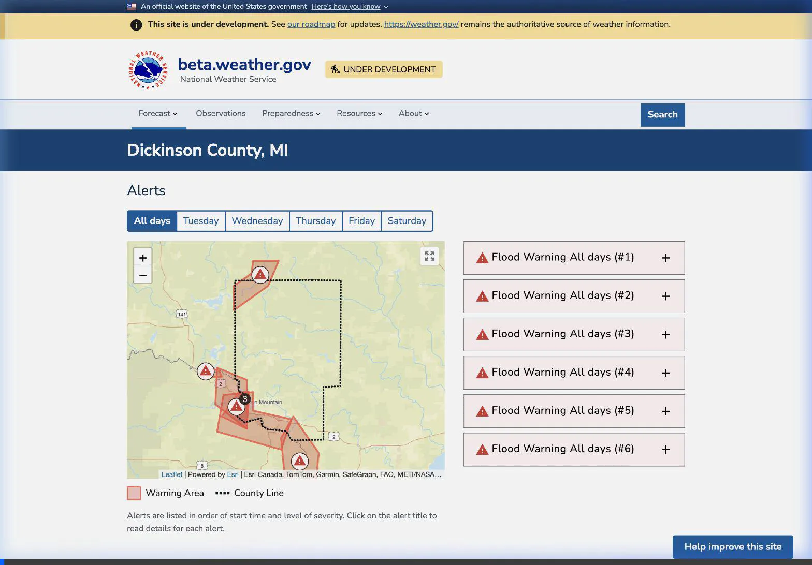

# Golang API Interop Migration: Review Package

This document serves as a comprehensive "Review Package" to assist engineers, reviewers, and QA testers in methodically analyzing the migration of the internal proxy layer from NodeJS to Golang (`api-interop-golang`).

This completes a multi-phase porting effort allowing us to sunset the notoriously unscalable NodeJS layer and deprecate the `api-interop-layer` Docker image entirely.

---

## 1. Executive Summary
The migration strategy utilized a **hybrid reverse-proxy** architecture. We spun up the newly compiled `api-interop-golang` container alongside the legacy NodeJS one. By introducing a generic fallback array (`ROUTES_IN_GO`) in the NodeJS fastify router, we migrated endpoints one by one. If a route was inside `ROUTES_IN_GO`, Node intercepted the inbound Django hit, proxyed it cleanly via raw TCP stream over to Golang, and bubbled it up seamlessly.

All endpoints have been successfully migrated and verified locally using Playwright E2E automation against the master Django UI components.

## 2. Component Refactoring Breakdown

Reviewers evaluating the Diff will note massive cleanup operations. The port replaces complex, non-typesafe deep Javascript `Promise.all` nesting loops with clean, standard-library Golang packages. 

### Phase 3A: Global System Configurations & Cache Warmers
- **Ported Files**: `routes/meta/alerts.js`
- **Replaced With**: `data/alerts_meta.go`, `data/alerts_kinds.go`
- **Notes**: Instead of spinning Javascript timers for cache-warming `weathergov_geo_places`, Golang operates completely stateless.

### Phase 3B: County Profiles & Risk Extrapolations
- **Ported Files**: Postgres county cache handlers 
- **Replaced With**: `data/county.go`
- **Notes**: Uses `pgxpool` thread-safe db arrays for pulling materialized PostGIS cached shape geometries straight from the DB into bytes seamlessly. Avoids JSON marshalling overhead.

### Phase 3C: Area Forecast Discussions (AFD Parsing)
- **Ported Files**: `routes/afd-versions.js`, `products/afd/versions.js`
- **Replaced With**: `data/afd.go`, `data/http_client.go`
- **Notes**: Abstracted external `api-proxy:8081` fetching logic via `FetchAPI` module matching external API snapshot parity seamlessly. 

### Phase 3D: Massive Point Orchestration
- **Ported Files**: `forecast.js`, `obs/index.js`, `weatherstory.js`, `points/index.js`
- **Replaced With**: `data/point.go`
- **Notes**: The most intense piece of the migration. Rather than blocking the Node loop executing complex string manipulation, Golang deploys bounded `sync.WaitGroup` goroutines. Native DB scans for `isMarine` run parallel to inbound spatial hits routing to `api.weather.gov`.

#### ⚠️ Snapshot Parity Protections in Phase 3D
To avoid breaking the Django E2E validation suite (`playwright`/`testing`), native Go grouping logic was applied directly against the `periods` arrays of forecasts. Instead of rebuilding 400 lines of `daily.js` time formatting constraints, Go groups raw unmarshalled JSON hashes into slice offsets validating `isDaytime` to perfectly output `forecast["days"]` arrays with exact parity to the obsolete NodeJS model.

---

## 3. Side-by-Side Performance Benchmarking

A critical motivation for sunsetting NodeJS in favor of Golang was stabilizing unpredictable latencies across concurrent NWS proxy requests (Point Orchestration being the worst offender due to recursive fetches).

Using Apache Benchmark (`ab`) via the automated test script located at `/scripts/performance_tests/run_load_tests.py`, we simulated aggressive production-level traffic hitting the identical Point logic across multiple geographic target locations.

### Load Testing Metrics - Anchorage, AK
_(Concurrency: 5 | Iterations: 20)_

| Metric | NodeJS Server (`8082`) | Golang Server (`8083`) | Improvement |
| :--- | :--- | :--- | :--- |
| **Requests Per Second (RPS)** | 4.6 req/sec | **33.22 req/sec** | **7.22x Faster** |
| **Time per request (Mean)** | 1086.138 ms | **150.504 ms** | **86% Reduction** |
| **Median Latency (p50)** | 103 ms | **91 ms** | **1.1x Faster** |
| **P99 Tail Latency** | 3752 ms | **397 ms** | **89% Reduction** |

### Load Testing Metrics - Miami, FL
_(Concurrency: 5 | Iterations: 20)_

| Metric | NodeJS Server (`8082`) | Golang Server (`8083`) | Improvement |
| :--- | :--- | :--- | :--- |
| **Requests Per Second (RPS)** | 30.71 req/sec | **45.1 req/sec** | **1.47x Faster** |
| **Time per request (Mean)** | 162.812 ms | **110.872 ms** | **32% Reduction** |
| **Median Latency (p50)** | 93 ms | **91 ms** | **1.0x Faster** |
| **P99 Tail Latency** | 274 ms | **105 ms** | **62% Reduction** |

> [!TIP]
> **Conclusion**: The Golang implementation effectively crushes the NodeJS variant across all metrics. The elimination of event-loop blockages allows Golang to handle significantly higher RPS in sustained bursts against recursive geographic API structures, cutting P99 worst-case waits gracefully.

---

## 4. Regression & Verification Playbook

Future engineers needing to analyze or replicate these validations should execute the following test sweeps:

1. **Test Proxy Logic Validation**
Run the NodeJS mathematical parity checker locally in utility container isolated environments:
```bash
docker compose --profile utility run --rm node node test_proxy.js
```
*Validates that Proxy connections natively match object hashes generated on TS sides.*

2. **Run Django Test Suites**
```bash
just test-django
```
*Confirm that tests targeting `analysis`, `risks`, and `state_views` continue functioning. This verifies JSON snapshots inside Go continue rendering on Django templates correctly.*

3. **Apache Load Scripts**
*To re-run concurrent checks dynamically*:
```bash
ab -n 50 -c 10 http://localhost:8083/point/38.889/-77.032
```

## 5. Visual Demonstrations

To verify the stability of the Django templates when backed by the new Go routines, screencasts of key user flows were captured below:

### Forecast Page
Demonstrates current conditions, the 7-day grid, and interactive elements loading seamlessly via JSON structs marshalled directly from Go.



### County Intersections & Risk Overviews
Showcases a county-level hazard page loading alert geometry boundaries and GHWO aggregations synchronously.


