# Weather.gov icons

These are the icons that are listed in the weather.gov API.

> **Note**  
> This list may be incomplete or inaccurate. The API endpoint that lists icons
> (https://api.weather.gov/icons) is marked as deprecated.

| Condition                         | Icon code         | Day icon                                   | Night icon                                     |
| --------------------------------- | ----------------- | ------------------------------------------ | ---------------------------------------------- |
| Fair/clear                        | `skc`             | 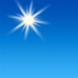             |              |
| A few clouds                      | `few`             | 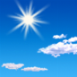             | 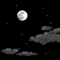             |
| Partly cloudy                     | `sct`             |              |              |
| Mostly cloudy                     | `bkn`             | 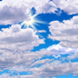             | 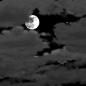             |
| Overcast                          | `ovc`             | 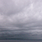             |              |
| Fair/clear and windy              | `wind_skc`        | 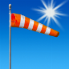        | 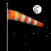        |
| A few clouds and windy            | `wind_few`        | 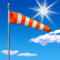        |         |
| Partly cloudy and windy           | `wind_sct`        | 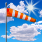        | 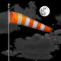        |
| Mostly cloudy and windy           | `wind_bkn`        | 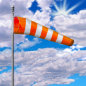        | 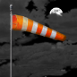        |
| Overcast and windy                | `wind_ovc`        | 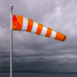        |         |
| Snow                              | `snow`            | 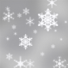            | 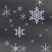            |
| Rain/snow                         | `rain_snow`       | 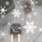       | 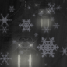       |
| Rain/sleet                        | `rain_sleet`      | 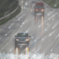      |       |
| Snow/sleet                        | `snow_sleet`      | 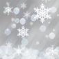      | 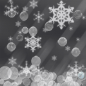      |
| Freezing rain                     | `fzra`            |             | 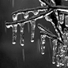            |
| Rain/freezing rain                | `rain_fzra`       | 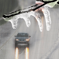       |        |
| Freezing rain/snow                | `snow_fzra`       | 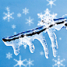       | 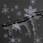       |
| Sleet                             | `sleet`           |            |            |
| Rain                              | `rain`            |             | 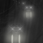            |
| Rain showers (high cloud cover)   | `rain_showers`    | 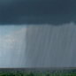    | 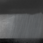    |
| Rain showers (low cloud cover)    | `rain_showers_hi` | 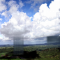 |  |
| Thunderstorm (high cloud cover)   | `tsra`            |             | 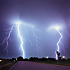            |
| Thunderstorm (medium cloud cover) | `tsra_sct`        | 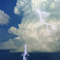        | 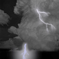        |
| Thunderstorm (low cloud cover)    | `tsra_hi`         |          | 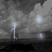         |
| Tornado                           | `tornado`         | 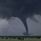         | 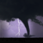         |
| Hurricane conditions              | `hurricane`       | 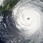       |        |
| Tropical storm conditions         | `tropical_storm`  |   | 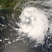  |
| Dust                              | `dust`            | 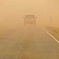            |             |
| Smoke                             | `smoke`           | 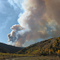           |            |
| Haze                              | `haze`            |             | 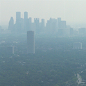            |
| Hot                               | `hot`             |              |              |
| Cold                              | `cold`            | 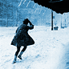            |             |
| Blizzard                          | `blizzard`        | 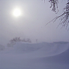        | 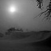        |
| Fog/mist                          | `fog`             | 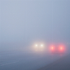             | 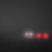             |
