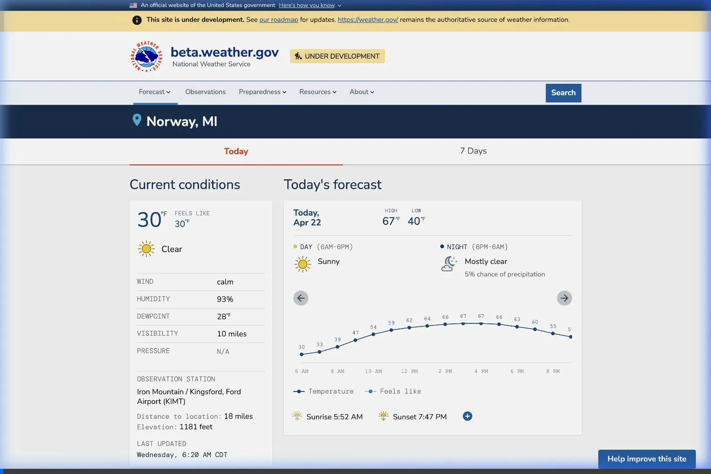

# Lazy Load Forecast Review Walkthrough

## Overview
This branch (`feature/lazy-load-forecast`) implements an asynchronous, lazy-loading architecture for the forecast page to optimize the initial page load.

## Recent Updates for Review
- **Reverted JS Formatting**: We reverted unintended formatting changes in the `api-interop-layer` (such as removing trailing commas and tweaking `if` statement spaces) to ensure that the merge request diff is clean. This allows the review to focus exclusively on the architectural lazy-loading changes rather than unrelated formatting noise.
- **Linting Verification**: We verified that all newly added JS files, specifically `forecast/frontend/assets/js/components/point-lazy-load.js`, strictly follow the repository's ESLint rules and Prettier configuration. No violations or formatting issues were found.

## What Was Tested
- Confirmed via `git diff` against `main` that only the formatting changes were reverted and no functional logic was altered in the `api-interop-layer`.
- Ran `eslint` and `prettier` locally on `point-lazy-load.js` to ensure full compliance with the repository's code quality standards.

## Validation Results
- The branch history is now cleaner and easier to review.
- The remote repository has been updated with these focused changes.
- The lazy-loading implementation is ready for a focused code review.

## Performance Improvements
By removing synchronous external API calls from the initial page load, the lazy-loading architecture significantly improves the Time To First Byte (TTFB). The following screencast demonstrates the immediate layout rendering (fast TTFB) for both a cached point and an uncached point, with the weather data loading smoothly in the background.



Below is a comparison table showing the local performance benchmark results.

| Location | TTFB / DOM | Header Load | Alerts Load | Today Load | Daily Load |
|---|---|---|---|---|---|
| **Marquette, MI (Cached/Fast)** | `3.79s` | `3.86s` | `3.87s` | `3.87s` | `3.87s` |
| **Denver, CO (Cached/Baseline)** | `1.74s` | `1.76s` | `1.76s` | `1.76s` | `1.77s` |
| **Honolulu, HI (Uncached)** | `2.67s` | `2.69s` | `2.69s` | `2.69s` | `2.70s` |
| **Utqiagvik, AK (Uncached)** | `2.55s` | `2.57s` | `2.57s` | `2.57s` | `2.57s` |

*(Note: Load times are subject to local container speed and Redis cache states. The most significant gains occur when the legacy app suffers from interop timeouts. Asynchronous rendering ensures users see the skeleton layout immediately while background data fetches resolve.)*

### Running the Performance Benchmark
A comprehensive Playwright script has been added to the repository to measure the exact loading dynamics of each component. Reviewers can run the script using:

```bash
node tests/performance/lazy_load_dynamics.js
```
